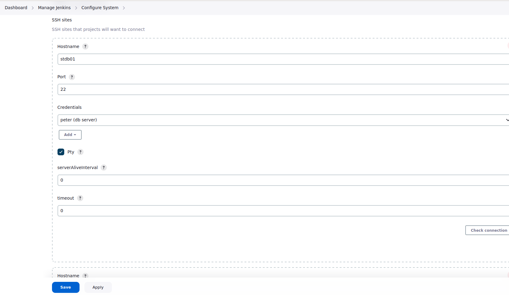

## Jenkins Database Backup Job

### Problem

There is a requirement to create a Jenkins job to automate the database backup. Below you can find more details to
accomplish this task:

Click on the Jenkins button on the top bar to access the Jenkins UI. Login using username admin and password Adm!n321.

    Create a Jenkins job named database-backup.

    Configure it to take a database dump of the kodekloud_db01 database present on the Database server in Stratos Datacenter, the database user is kodekloud_roy and password is asdfgdsd.

    The dump should be named in db_$(date +%F).sql format, where date +%F is the current date.

    Copy the db_$(date +%F).sql dump to the Backup Server under location /home/clint/db_backups.

    Further, schedule this job to run periodically at */10 * * * * (please use this exact schedule format).

Note:

    You might need to install some plugins and restart Jenkins service. So, we recommend clicking on Restart Jenkins when installation is complete and no jobs are running on plugin installation/update page i.e update centre. Also, Jenkins UI sometimes gets stuck when Jenkins service restarts in the back end. In this case please make sure to refresh the UI page.

    Please make sure to define you cron expression like this */10 * * * * (this is just an example to run job every 10 minutes).

    For these kind of scenarios requiring changes to be done in a web UI, please take screenshots so that you can share it with us for review in case your task is marked incomplete. You may also consider using a screen recording software such as loom.com to record and share your work.

### Solution

- Install Plugins: SSH, SSH Credentials, Publish over SSH
- Manage Jenkins -> Credentials -> Add Credentials -> Username with password
  
- Manage Jenkins -> Configure System -> Add SSH remote hosts
  
- Dashboard -> database-backup -> Configuration: Build Steps -> Execute shell on remote host

- This way need to install sshpass on Nautilus DB Server (stdb01)

```shell
  mysqldump kodekloud_db01 -u kodekloud_roy -pasdfgdsd > db_$(date +%F).sql
  sshpass -p "H@wk3y3" scp -p -o StrictHostKeyChecking=no db_$(date +%F).sql clint@stbkp01:/home/clint/db_backups
```
    